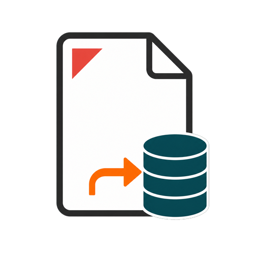
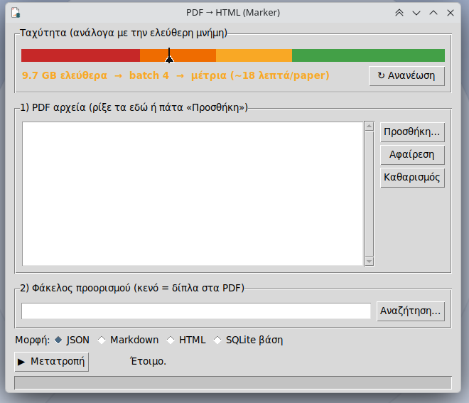

# PDFextract



PDFextract is a local-first Linux desktop application for converting PDFs into
structured JSON, Markdown, HTML, or a searchable SQLite knowledge base. It uses
[Marker](https://github.com/datalab-to/marker) and Surya for document conversion,
adds low-memory page chunking, and provides page-based progress and measured ETA.

- PDFs and generated databases stay on the local machine.
- Model weights are **not included** in this repository or its release packages.
- The first launch creates a per-user virtual environment and downloads the
  upstream Marker/Surya models. Optional semantic search downloads BAAI/bge-m3
  only when embeddings are enabled.
- The main Debian package targets Ubuntu/Kubuntu-family Linux distributions.

## Screenshot



## Install on Ubuntu or Kubuntu

Download the latest `.deb` from the GitHub Releases page, then run:

```bash
sudo apt install ./pdf-html_1.1.4_all.deb
```

Open **PDF → DB (Marker)** from the application menu. The first launch needs an
internet connection and can take some time because it installs the Python runtime
dependencies and downloads the OCR/layout models. Later launches reuse the local
environment and caches.

Recommended: 12 GB RAM or more, with roughly 8 GB available during conversion.
The application automatically lowers batch size when less memory is available.

## What is included

This repository contains the application and integration source, GUI, renderers,
SQLite schema, query tools, packaging scripts, and icon. It deliberately excludes
PDFs, converted content, databases, model files, caches, logs, and virtual
environments. See [third-party projects](THIRD_PARTY_NOTICES.md),
[contribution guidelines](CONTRIBUTING.md), and the [GNU GPL v3 license](LICENSE).

## Ελληνική τεκμηρίωση

Μετατρέπει ερευνητικά PDF σε δομημένη μορφή και τα βάζει σε μια **SQLite βάση**
ώστε ο agent (Claude) να χτίζει εργασίες **ενότητα-ενότητα** αντλώντας από αυτή.
Διατηρείται ο **σκελετός** (τίτλος, σελίδες, ενότητες) και **δεν χάνεται γραμμή**.
Backend μετατροπής: [Marker](https://pypi.org/project/marker-pdf/) (Surya OCR).

## ⚠️ ΜΝΗΜΗ — διάβασέ το πρώτα
Το Marker χρειάζεται περίπου **8 GB διαθέσιμη RAM**. Προτείνονται 12 GB συνολικής
RAM ή περισσότερα. Κλείσε βαριές εφαρμογές ή virtual machines πριν από μεγάλη
μετατροπή. Η εφαρμογή μειώνει αυτόματα το batch size όταν η διαθέσιμη μνήμη είναι
περιορισμένη. Η επεξεργασία είναι CPU-only και μπορεί να χρειαστεί αρκετά λεπτά.

## Pipeline

```bash
cd ~/Έγγραφα/Claude/Coding/PDF-HTML

# 1) PDF -> JSON  (default format=json· έξοδος δίπλα στο PDF· χαμηλή μνήμη/chunks)
.venv/bin/python convert.py PDFs/*.pdf
#   επιλογές: --format md|html|json  --chunk N (μικρότερο=λιγότερη RAM)  --out DIR

# 2) JSON -> SQLite (papers.db) — κάθε block αποθηκεύεται (δεν χάνεται γραμμή)
.venv/bin/python ingest.py PDFs/*/*.json        # --reset για ξαναχτίσιμο

# 2β) Σημασιολογική ενσωμάτωση ενοτήτων (BAAI/bge-m3 → sqlite-vec· idempotent)
.venv/bin/python embed.py                        # ενσωματώνει ό,τι λείπει/άλλαξε
.venv/bin/python embed.py --status               # κατάσταση   (--reset για όλα)

# 3) Ερωτήματα στη βάση
.venv/bin/python query.py papers                 # λίστα paper (+#ενότητες, #annotations)
.venv/bin/python query.py sections <paper_id>    # ενότητες + annotations
.venv/bin/python query.py section <section_id>   # πλήρες κείμενο ενότητας (blocks)
.venv/bin/python query.py search "όρος"          # full-text (FTS5· ακριβείς λέξεις)
.venv/bin/python query.py semantic "ιδέα"        # σημασιολογικά (bge-m3 + sqlite-vec)
.venv/bin/python query.py hybrid "ιδέα"          # λέξεις + νόημα (RRF) — προτεινόμενο
.venv/bin/python query.py todo                   # ενότητες χωρίς annotation

# 4) Σχολιασμός ανά ενότητα (who_speaks / whose_paper / importance / summary)
.venv/bin/python annotate.py set <sid> --who "..." --whose "..." --importance "..." --summary "..."
.venv/bin/python annotate.py load annotations.json   # bulk: [{section_id, who_speaks, ...}]
.venv/bin/python annotate.py api --paper <id>        # αυτόματα — ΜΟΝΟ αν υπάρχει ANTHROPIC_API_KEY
```

## GUI & εγκατάσταση

```bash
./run.sh            # [1] PDF→HTML/JSON GUI (μόνο convert· wizard μοντέλων Marker)
./run_db.sh         # [2] Knowledge-Base GUI: χτίσιμο ΒΑΣΗΣ ανά χρήση (από PDF ή JSON)
./run_kb.sh         # [3] Combined «overnight»: PDF → Βάση + Skill σε φάκελο-πακέτο
./install.sh        # launcher «PDF → DB (Marker)» στο μενού εφαρμογών
```

**Τρία GUI, σκόπιμα χωριστά:** [1] μόνο μετατροπή (αργό/RAM-βαρύ, για όλη νύχτα),
[2] μόνο βάση (από έτοιμα JSON), [3] **όλα μαζί χωρίς επιτήρηση** → ένας φάκελος
έτοιμος για σύνθεση στο cowork.

### Combined «overnight» (`kb_gui.py` / `run_kb.sh`)

Δώσε 10 PDF, πάτα «Χτίσιμο πακέτου», κοιμήσου. Το pipeline (μέσω `build.py`):
1. **Convert** (Marker, υποδιεργασία) — η μνήμη ~8GB ελευθερώνεται στο τέλος.
2. **Incremental ingest** — κάθε PDF που τελειώνει μπαίνει ΑΜΕΣΩΣ στη βάση
   (crash-safe: αν σκάσει στο 7ο, τα 1-6 είναι σωσμένα).
3. **Embed** (bge-m3) στο τέλος — τα δύο βαριά μοντέλα ΔΕΝ συνυπάρχουν στη RAM.
4. **README.md** (manifest) στον φάκελο — δείχνει στο skill `knowledge-base`.

Αποτέλεσμα: `output/<όνομα>/` με `<όνομα>.db` + `README.md` (manifest). Το πρωί
ανοίγεις τον φάκελο στο cowork, το skill **`knowledge-base`** αναλαμβάνει την
ΟΛΟΚΛΗΡΩΣΗ (μεταδεδομένα) & σύνθεση — **όλα τοπικά/δωρεάν, χωρίς API key.**

```bash
# CLI ισοδύναμο (για cron/overnight χωρίς GUI):
.venv/bin/python build.py --out output/science_papers --kind research \
    --topic "Βιντεοπαιχνίδια & επιθετικότητα" --manifest PDFs/*.pdf
```

**Skills (2):** `skill/academic-db` (εργασία/πτυχιακή) · `skill/knowledge-base`
(build/finish/query για lesson/assessment/personal/notes/general). Τα per-folder
`README.md` είναι manifests, **όχι** εγγεγραμμένα skills.

### Knowledge-Base GUI (`db_gui.py`) — μία βάση ανά χρήση

Διάλεξε **χρήση** (profile), ρίξε PDF ή έτοιμα JSON, και χτίζει αυτόματα τη βάση
της χρήσης (convert → ingest → embed) μέσω του `build.py`. Κάθε χρήση = δικό της
αρχείο στο `databases/<key>.db`, ώστε ο agent να ξέρει «τι μπαίνει σε εργασία και
τι όχι».

**Χρήσεις & μεταδεδομένα** (ορίζονται στο `profiles.py` — η «bullet list» που ο
agent γεμίζει αυτόματα, με δικό σου έλεγχο):

| Profile | Βάση | Κρατά (ενδεικτικά) |
|---|---|---|
| **research** | `databases/research.db` | authors, year, doi, study_type, key_findings · ενότητες paper |
| **thesis** | `databases/thesis.db` | + apa, research_question, thesis_section, stance (academic-db) |
| **lesson** | `databases/lesson.db` | subject, grade, unit, prev/next, objectives, methodology, tools, techniques |
| **assessment** | `databases/assessment.db` | subject, grade, objective, question_type, difficulty (Bloom), answer_key |
| **personal** | `databases/personal.db` | category, people, date, location, sensitivity |
| **notes** | `databases/notes.db` | topic, source, tags, links, status (Zettelkasten) |
| **general** | `databases/general.db` | title, source, tags, summary |

Το `papers` πίνακα κάθε βάσης σφραγίζεται με `kind` (η χρήση) και κρατά τα πεδία
του profile ως JSON στη στήλη `meta`. Δες τα όλα: `python profiles.py`.

**GUI:** ρίξε PDF (drag & drop) ή «Προσθήκη…»· προορισμός **κενός = δίπλα στα PDF**·
format JSON/Markdown/HTML/**SQLite βάση**· κουμπί «Μετατροπή» + spinner + progress.
Η επιλογή SQLite γράφει ένα queryable `papers.db` στον φάκελο προορισμού (ή δίπλα
στο πρώτο PDF), με πίνακες `papers`, `sections`, `blocks` και full-text search.
Τα embeddings παραμένουν προαιρετικό ξεχωριστό βήμα ώστε να μη γίνει απρόσμενη
λήψη του μεγάλου μοντέλου bge-m3 από το απλό παράθυρο μετατροπής.

Το κύριο GUI διαβάζει άμεσα το πλήθος σελίδων κάθε PDF χωρίς OCR, εμφανίζει το
σύνολο πριν ξεκινήσει και ενημερώνει την πρόοδο ανά ολοκληρωμένο chunk σελίδων.
Μετά το πρώτο chunk υπολογίζει εκτιμώμενο υπόλοιπο χρόνο από την πραγματική
ταχύτητα του τρέχοντος μηχανήματος και των συγκεκριμένων PDF.

**Πακέτα:** build με `bash packaging/build-deb.sh` ή `bash packaging/build-rpm.sh`.
Τα παραγόμενα αρχεία γράφονται τοπικά στο `packaging/dist/` και δεν μπαίνουν στο Git·
το `.deb` της έκδοσης διανέμεται ως GitHub Release asset.
Το εγκατεστημένο πακέτο στήνει **per-user venv** + κατεβάζει μοντέλα στην 1η εκκίνηση.

## Αρχεία

| Αρχείο | Ρόλος |
|---|---|
| `convert.py` | PDF → JSON/MD/HTML (Marker, chunked, διόρθωση σελίδων, χαμηλή μνήμη) |
| `db.py` | Σχήμα SQLite (papers/sections/blocks/annotations + FTS5 + sqlite-vec) |
| `ingest.py` | JSON → βάση (κάθε block· ομαδοποίηση σε ενότητες) |
| `embed.py` | Ενσωμάτωση ενοτήτων (BAAI/bge-m3 → vec_sections· idempotent με sha256) |
| `query.py` | Ερωτήματα: papers/sections/section/search/**semantic/hybrid**/todo |
| `profiles.py` | Χρήσεις (research/thesis/lesson/assessment/personal/notes/general) + μεταδεδομένα |
| `build.py` | Driver: convert→ingest (incremental)→embed→skill· `--out` φάκελος-πακέτο |
| `make_skill.py` | Γεννήτρια manifest (README.md) ανά φάκελο-πακέτο — δείχνει στο `knowledge-base` |
| `db_gui.py` | Knowledge-Base GUI [2] (επιλογή χρήσης, drag&drop, πρόοδος) |
| `kb_gui.py` | Combined «overnight» GUI [3] (PDF → φάκελος-πακέτο db + skill) |
| `annotate.py` | Σχολιασμός ανά ενότητα (manual/bulk/API) |
| `gui.py` | Παράθυρο tkinter (drag & drop, spinner) |
| `firstrun.py` | Wizard λήψης μοντέλων (progress + retry) |
| `run.sh` / `install.sh` | Εκκίνηση / εγκατάσταση |
| `packaging/` | spec + build-rpm.sh + dist/*.rpm |

## Μορφές εξόδου του `convert.py`

| `--format` | Περιεχόμενο | Χρήση |
|---|---|---|
| **`json`** (default) | Δομή ανά σελίδα/block + ρητό `page` | Είσοδος για `ingest.py` |
| `md` | Τίτλος + `<!-- σελίδα N -->` + `## ενότητες` + κείμενο + πίνακες | Ανθρώπινη ανάγνωση |
| `html` | Ίδια δομή σε HTML | Προβολή σε browser |
| **SQLite βάση (GUI)** | `papers.db` με papers/sections/blocks + FTS5 | Τοπικά queries και knowledge base |

## Σημασιολογική αναζήτηση (semantic / hybrid)

Δύο τρόποι retrieval ζουν μαζί στη **μία** βάση:
- **`search`** (FTS5) — ακριβείς λέξεις/όροι.
- **`semantic`** (bge-m3 + sqlite-vec) — ομοιότητα **κατά νόημα** σε επίπεδο ενότητας.
- **`hybrid`** — συγχωνεύει τα δύο με **Reciprocal Rank Fusion** (το προτεινόμενο).

Η ενσωμάτωση είναι **idempotent**: κάθε ενότητα κρατά sha256 του κειμένου της στο
`section_embed_meta`, οπότε το `embed.py` ξανατρέχει μόνο ό,τι άλλαξε. Το μοντέλο
(`BAAI/bge-m3`, 1024 διαστάσεις, ~2.2GB) κατεβαίνει στην 1η χρήση. Αν το sqlite-vec
δεν φορτωθεί, η βάση δουλεύει κανονικά **μόνο** με FTS5 (graceful degrade).

## Περιβάλλον
Worker Python **3.13** (`.venv`) με torch **CPU**· native system Python/Tk για το GUI.
Διόρθωση σελίδων ανά chunk (απόλυτοι αριθμοί).
Άλλη βάση: `PAPERSDB=/path/to.db` (όλα τα εργαλεία, incl. `embed.py`, το σέβονται).
Εξαρτήσεις σημασιολογικού layer: `pip install sentence-transformers sqlite-vec`.
